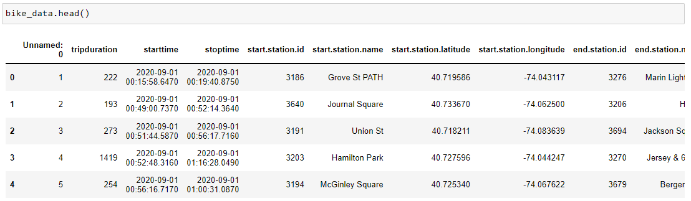

# City Bike Dataset
Dataset on the City Bikes

Dataset taken here:  
https://www.kaggle.com/datasets/karthikbhandary2/city-bike-dataset/data

### About Dataset
Where do Citi Bikers ride? When do they ride? How far do they go? Which stations are most  
popular? What days of the week are most rides taken on? We've heard all of these questions and  
more from you, and we're happy to provide the data to help you discover the answers to these   
questions and more. We invite developers, engineers, statisticians, artists, academics, and other  
interested members of the public to use the data we provide for analysis, development,  
visualization and w and whatever else moves you.

`bike_data.scv`:

The jupyter notebook includes:
- Data preparation
- Visualization of maps: *points of start stations and points of end stations*, *heatmap of stations*, *top popular routes*,  
*longest route*
- Visualization of graphs: *top popular station*, *top popular route*, *distribution of the number of trips by time*, 
*distribution of the number of trips by days of the week*, *distribution of the number of riders by gender*,   
*distribution of the number of riders by age group*, *distribution of the number of riders by age*

## Contacts

---
### Vitkovskiy Volodymyr
- email: VitkovskyiVB@gmail.com
- telegram: @wvld_11
- github: [Vvold](https://github.com/Vvold)